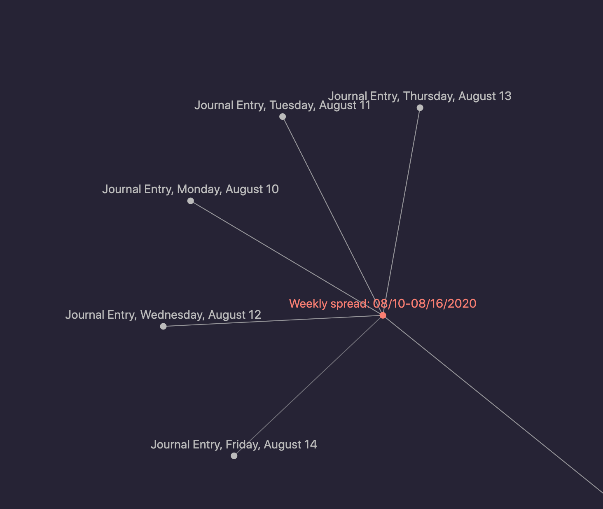

# Journal

## How I'm using it

I'm making an effort to journal daily in my private Foam workspace. I have been rocking my own spin on bullet journaling for a few years and am experimenting with how to incorporate that into my new digital workflow.

## What I'm doing at the moment

> 🚨This section is ever-evolving and everything below is subject to change as I continue to explore 🚨

Use the [[weekly-template]] to spin up a [[weekly-spread]]. Link each day of the week in the weekly spread, using the [[daily-template]], and you'll end up with a nifty little mind node like this:

[//begin]: # "Autogenerated link references for markdown compatibility"
[weekly-spread]: journal/weekly-spread/weekly-spread.md "Weekly Spread"
[daily-template]: journal/daily-template.md "Daily Template"
[//end]: # "Autogenerated link references"
